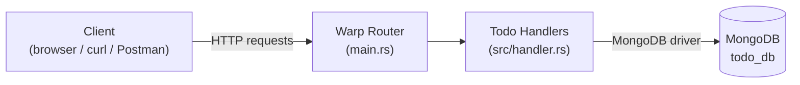

# 🦀 Rust Todo API


A lightweight, production-style RESTful **Todo API** built with [Rust](https://www.rust-lang.org/), the [Warp](https://github.com/seanmonstar/warp) web framework, and [MongoDB](https://www.mongodb.com/) for persistence.

## Table of Contents

- [Features](#features)
- [Tech Stack](#tech-stack)
- [Architecture](#architecture)
- [API Reference](#api-reference)
- [Getting Started](#getting-started)
- [Configuration](#configuration)
- [Running with Docker](#running-with-docker)
- [Example Requests](#example-requests)
- [Project Structure](#project-structure)
- [Contributing](#contributing)
- [License](#license)

## Features

- ✅ RESTful CRUD endpoints for managing todo items
- 🗄️ Persistent storage backed by MongoDB
- ⚙️ Configuration via environment variables (12-factor friendly)
- 🐳 Docker & Docker Compose support out of the box
- ❤️ Health check endpoint for readiness/liveness probes
- 📄 OpenAPI 3.0 specification (see [`docs/openapi.yaml`](docs/openapi.yaml))

## Tech Stack

| Layer            | Technology                                                                     |
| ----------------- | -------------------------------------------------------------------------------- |
| Language          | [Rust](https://www.rust-lang.org/) (stable, edition 2021)                        |
| HTTP Framework    | [Warp](https://github.com/seanmonstar/warp)                                      |
| Database          | [MongoDB](https://www.mongodb.com/) via the official [Rust driver](https://github.com/mongodb/mongo-rust-driver) |
| Async Runtime     | [Tokio](https://tokio.rs/)                                                       |
| Containerization  | Docker & Docker Compose                                                          |

## Architecture

The API is composed of three main layers: the Warp HTTP router, the handler
layer holding the business logic, and MongoDB as the data store.



A more detailed breakdown, including the request lifecycle and the Docker
Compose deployment topology, is available in
[`docs/ARCHITECTURE.md`](docs/ARCHITECTURE.md).

## API Reference

Full machine-readable definition: [`docs/openapi.yaml`](docs/openapi.yaml)
(importable into [Swagger Editor](https://editor.swagger.io/), Postman, or
Insomnia).

| Method   | Endpoint             | Description             |
| -------- | ---------------------- | -------------------------- |
| `POST`   | `/api/todos`           | Create a new todo           |
| `GET`    | `/api/todos`           | List todos (paginated)       |
| `GET`    | `/api/todos/{id}`      | Retrieve a todo by ID        |
| `PATCH`  | `/api/todos/{id}`      | Update an existing todo      |
| `DELETE` | `/api/todos/{id}`      | Delete a todo by ID          |
| `GET`    | `/api/healthchecker`   | Check API health              |

### Todo model

```json
{
  "id": "660d2c1f9a1e4a1a2c8b4567",
  "title": "Buy groceries",
  "content": "Milk, eggs, bread, and coffee",
  "completed": false,
  "createdAt": "2026-08-27T10:00:00Z",
  "updatedAt": "2026-08-27T10:00:00Z"
}
```

## Getting Started

### Prerequisites

- [Rust](https://www.rust-lang.org/tools/install) (stable toolchain)
- [Docker](https://www.docker.com/products/docker-desktop) (optional, for running MongoDB or the full stack in containers)
- A running MongoDB instance (locally or via Docker)

### Clone the repository

```bash
git clone https://github.com/your-username/rust-api.git
cd rust-api
```

### Run MongoDB (optional, if not using Docker Compose)

```bash
docker run --name mongodb -d -p 27017:27017 mongo:latest
```

### Run the application

```bash
cargo run
```

The API will start at `http://localhost:8000`.

## Configuration

The application is configured via environment variables. Copy
[`.env.example`](.env.example) to `.env` and adjust as needed, then export
the values before running `cargo run` (e.g. `export $(cat .env | xargs)`):

| Variable    | Description                       | Default                        |
| ----------- | ---------------------------------- | ------------------------------- |
| `PORT`      | HTTP port the server listens on    | `8000`                           |
| `MONGO_URI` | MongoDB connection string          | `mongodb://mongodb:27017`         |
| `MONGO_DB`  | MongoDB database name              | `todo_db`                         |

## Running with Docker

Build and run both the API and MongoDB with Docker Compose:

```bash
docker compose up --build
```

The API will be available at `http://localhost:8000` and MongoDB at
`localhost:27017`. Data is persisted in a named Docker volume
(`mongo_data`).

## Example Requests

Create a new Todo:

```bash
curl -X POST http://localhost:8000/api/todos \
  -H "Content-Type: application/json" \
  -d '{"title": "Sample Todo", "content": "This is a sample todo item"}'
```

Retrieve all Todos:

```bash
curl http://localhost:8000/api/todos
```

Retrieve a specific Todo by ID:

```bash
curl http://localhost:8000/api/todos/{id}
```

Update a Todo:

```bash
curl -X PATCH http://localhost:8000/api/todos/{id} \
  -H "Content-Type: application/json" \
  -d '{"completed": true}'
```

Delete a Todo:

```bash
curl -X DELETE http://localhost:8000/api/todos/{id}
```

Health check:

```bash
curl http://localhost:8000/api/healthchecker
```

## Project Structure

```
.
├── docker-compose.yml     # Multi-container setup (API + MongoDB)
├── Dockerfile              # Multi-stage build for the API service
├── docs/
│   ├── ARCHITECTURE.md     # Architecture and sequence diagrams
│   └── openapi.yaml        # OpenAPI 3.0 API specification
├── src/
│   ├── main.rs              # Application entry point, routing, and MongoDB setup
│   ├── handler.rs           # HTTP handlers implementing CRUD + health check
│   ├── model.rs              # Todo model and request/query payloads
│   └── response.rs           # JSON response envelopes
└── Cargo.toml               # Rust crate manifest
```

## Contributing

Contributions are welcome! Please open an issue to discuss significant
changes, then submit a pull request. For smaller fixes, feel free to open a
PR directly.

1. Fork the repository
2. Create a feature branch (`git checkout -b feature/my-feature`)
3. Commit your changes
4. Push to your branch and open a pull request

## License

This project is licensed under the Apache License 2.0 - see the
[LICENSE](LICENSE) file for details.

