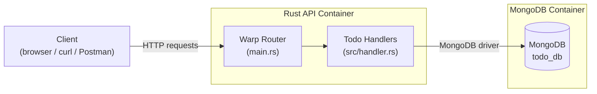
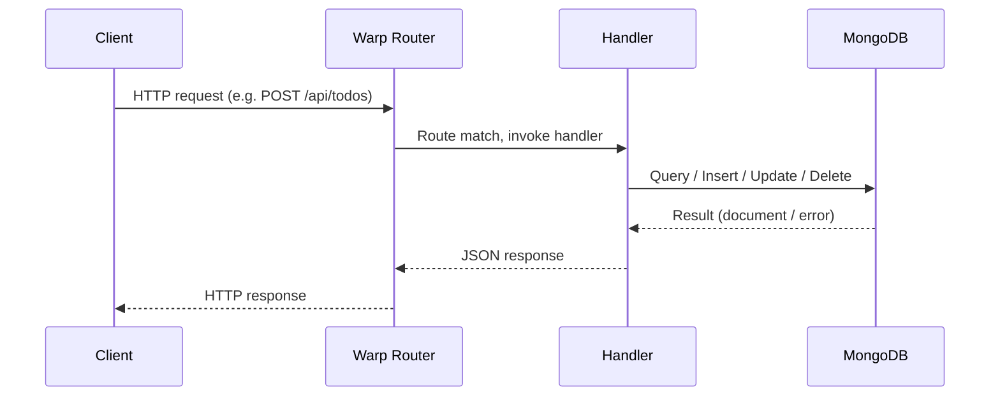
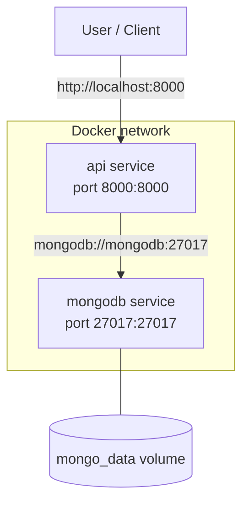

# Architecture

## Overview

The API follows a simple, layered architecture: an HTTP layer (Warp), a
handler layer that contains the business logic, and MongoDB as the
persistence layer.

## Request lifecycle

## Components

| Component      | Responsibility                                                                    |
| -------------- | ---------------------------------------------------------------------------------- |
| `main.rs`      | Bootstraps the app: reads config, connects to MongoDB, registers routes, starts the HTTP server. |
| `handler.rs`   | Implements the CRUD handlers and the health check endpoint.                        |
| `model.rs`     | Defines the `Todo` document shape and request/query payloads.                      |
| `response.rs`  | Defines the JSON response envelopes returned to clients.                           |
| MongoDB        | Stores `Todo` documents in the `todos` collection, inside the `todo_db` database.   |

## Connecting to MongoDB

The connection is established once at startup:

1. `main.rs` reads the connection settings from environment variables
   (`MONGO_URI`, `MONGO_DB`), falling back to sane defaults for local
   development.
2. A `mongodb::Client` is created and a `ping` command is issued to verify
   connectivity before the HTTP server starts accepting traffic.
3. The resulting `Database` handle is wrapped in an `Arc` and passed into
   every handler via a Warp filter, so each request can access the `todos`
   collection.

This keeps the database connection pooled and reused across requests instead
of opening a new connection per request.

## Deployment topology (Docker Compose)

</content>
